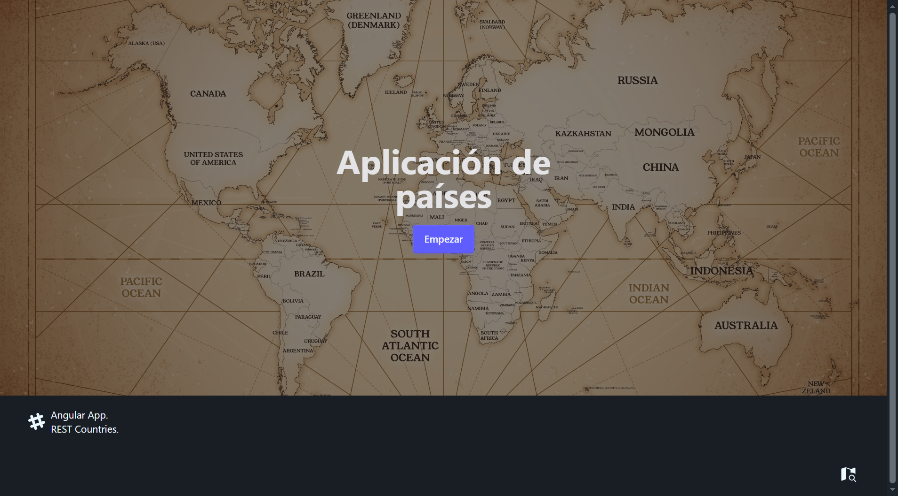
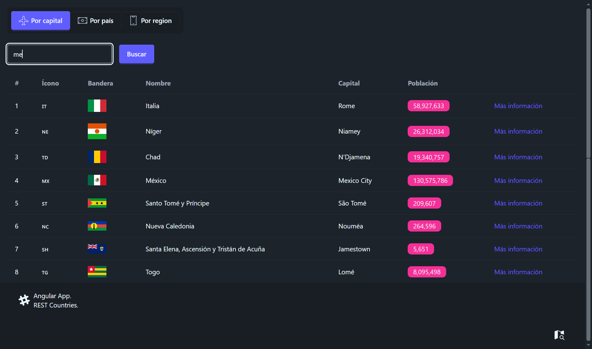
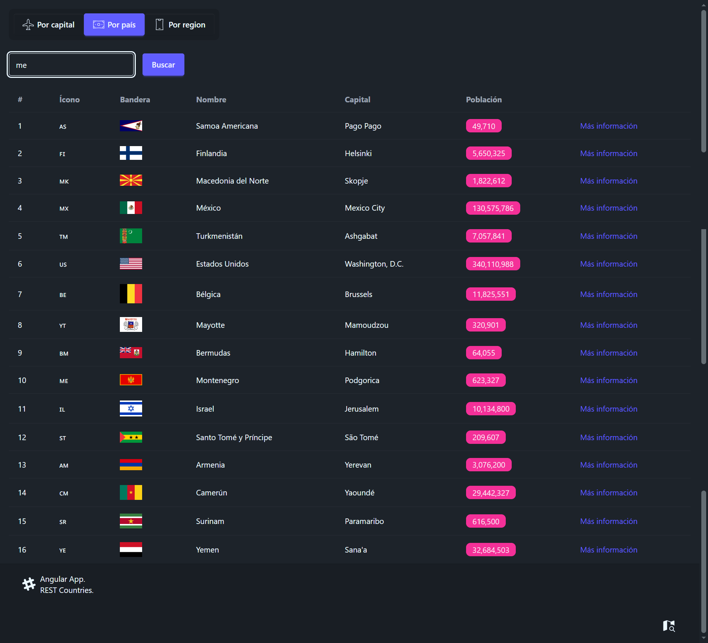
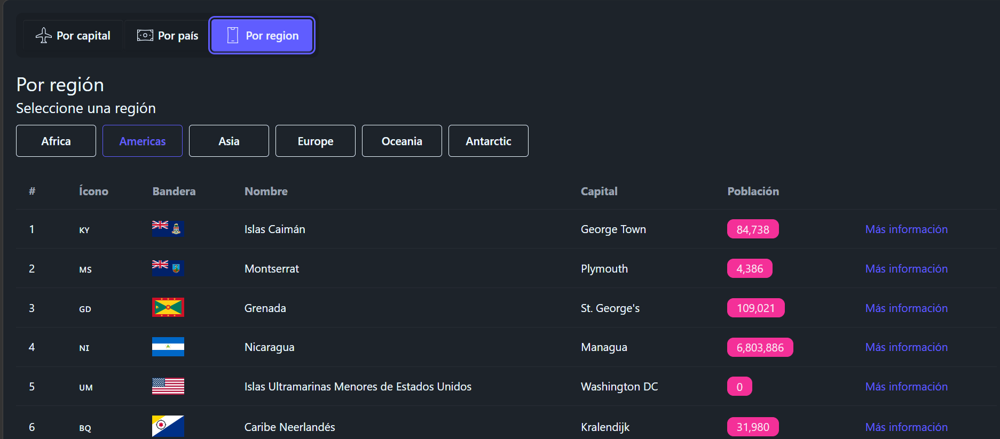

# Country App

<p align="center">
  
  &nbsp;
  
  &nbsp;
  
</p>

<p align="center">
  Explorador de países en español: <strong>elige una región, compara vecinos y abre la ficha</strong> (bandera, capital y población) con datos de REST Countries.
</p>

<p align="center">
  <a href="https://country-app-miguel.netlify.app/">Ver demo en vivo</a>
</p>

---

## Descripción

**Country App** es una SPA de Angular que consulta REST Countries v5 y presenta cada resultado en un mapa mural de aula. La unidad de exploración es la región: África, Américas, Asia, Europa, Oceanía y Antártida. La búsqueda por capital o por nombre es un atajo hacia el mismo marco, no una tabla suelta.

La interfaz está en español, usa routing con hash y no guarda cuentas ni persistencia. Solo muestra lo que la API entrega: nombre, código, bandera, capital, población, región y subregión.

## Características

- **Lámina por región** — Cada continente tiene su propio mapa. El rail de papel lista países con bandera, capital y población para compararlos sin salir de la región.
- **Atajo por capital** — El buscador consulta `/capitals` y deja la query en la URL. Sin resultados, el rail lo dice.
- **Atajo por país** — El buscador consulta `/name` con el mismo patrón de query, carga y vacío.
- **Ficha de país** — Ruta `/country/by/:code` con bandera, capital, población, región y subregión.
- **Consulta en la URL** — Región y texto de búsqueda viajan en query params; se puede recargar o compartir el enlace.
- **Caché en memoria** — El servicio recuerda capital, nombre y región ya consultados durante la sesión.

## Rutas

| Ruta | Qué hace |
|------|----------|
| `/` | Portada. Enlace **Desplegar lámina** abre Américas. |
| `/#/country/by-region?region=Europe` | Mapa de la región y lista de países. Sin región válida, cae en Américas. |
| `/#/country/by-capital?query=tokyo` | Búsqueda por capital. |
| `/#/country/by-country?query=mexico` | Búsqueda por nombre de país. |
| `/#/country/by/MX` | Ficha del código alpha-2. Si no existe, muestra que no está en la lámina. |
| `/#/country/**` | Redirige a `by-region`. |

Regiones válidas: `Africa`, `Americas`, `Asia`, `Europe`, `Oceania`, `Antarctic`.

## Capturas









## Stack tecnológico

| Tecnología     | Versión |
|----------------|---------|
| Angular        | 21      |
| TypeScript     | 5.9     |
| Tailwind CSS   | 4       |
| RxJS           | 7       |

**Patrones usados:** componentes standalone, lazy loading del módulo `country`, `signals` + `rxResource`, `HashLocationStrategy`, mapper de la respuesta v5 y caché en memoria por consulta.

## Estructura del proyecto

```
src/
├── app/
│   ├── country/              # Explorador: páginas, layout, servicio y mapper
│   │   ├── components/       # Lista, buscador y pestañas
│   │   ├── layouts/          # Marco del mapa mural
│   │   ├── pages/            # Región, capital, país y ficha
│   │   ├── interfaces/
│   │   ├── mappers/
│   │   └── services/
│   └── shared/               # Home, footer, carga y no encontrado
├── environments/             # API_URL y API_KEY
└── styles/                   # Layout del mapa mural
```

## Instalación local

Clona el repositorio:

```bash
git clone https://github.com/miguel-camara/country-app.git
cd country-app
```

Instala las dependencias:

```bash
npm install
```

Configura `API_KEY` en `src/environments/environment.development.ts` (y en `environment.ts` para producción).

Inicia el servidor de desarrollo:

```bash
npm run start
```

Abre [http://localhost:4200](http://localhost:4200) en el navegador.

## Variables de entorno

Viven en `src/environments/environment.ts` y `environment.development.ts`. No hay archivo `.env`.

| Variable  | Uso |
|-----------|-----|
| `API_URL` | Base de REST Countries v5 (`https://api.restcountries.com/countries/v5`) |
| `API_KEY` | Bearer token enviado en `Authorization` |

## Scripts disponibles

| Comando           | Descripción                                      |
|-------------------|--------------------------------------------------|
| `npm run start`   | Servidor de desarrollo y abre el navegador       |
| `npm run build`   | Compila la app                                   |
| `npm run watch`   | Compila en modo development y observa cambios    |
| `npm run test`    | Ejecuta las pruebas                              |

## Demo

🔗 [https://country-app-miguel.netlify.app/](https://country-app-miguel.netlify.app/)

## Autor

[Miguel Cámara](https://github.com/miguel-camara)
